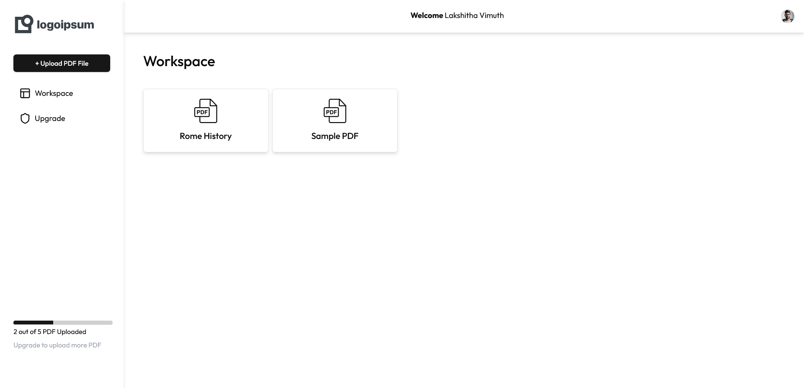

# AI Note Taking SAAS App

AI Note Taking App is a smart and interactive note-taking application designed to enhance your productivity by integrating AI-driven features. This app uses cutting-edge technologies to provide a seamless experience for organizing and interacting with notes.


## Features

- **AI-Powered Note Analysis**: Powered by Google Generative AI API and Gemini API for advanced NLP capabilities.
- **Secure Authentication**: Managed through Clerk integration.
- **Real-time Updates and Data Sync**: Using Convex for efficient backend handling and real-time data.
- **UI/UX with ShadCN and Radix UI**: Smooth and responsive interface using ShadCN UI, Radix UI components, and Tailwind CSS.
- **Document Handling and PDF Parsing**: Built-in PDF parsing powered by pdf-parse.
- **Flexible Rich Text Editing**: Using Tiptap extensions for enhanced note formatting.
- **Integration with Payment Gateway**: PayPal integration for handling transactions.

## Technologies Used

- **Next.js**: For server-side rendering and routing.
- **Convex**: Real-time data synchronization.
- **Clerk**: Authentication services.
- **Google Generative AI API & Gemini API**: For natural language processing.
- **Langchain**: AI workflows and language model integrations.
- **ShadCN UI and Radix UI Components**: For a polished UI/UX.
- **Tiptap**: Advanced text editing and rich text extensions.
- **PayPal API**: Payment gateway integration.
- **Tailwind CSS**: For responsive and modern styling.

## Installation

### Prerequisites

- **Node.js** (v14 or higher)
- **npm** (v6 or higher)

### Steps

1. **Clone the Repository**
   ```bash
   git clone https://github.com/lvimuth/AI-Note-Taking-App.git
   ```
2. **Navigate to the Project Directory**
   ```bash
   cd ai-note-taking-app
   ```
3. **Install Dependencies**
   ```bash
   npm install
   ```
4. **Run the Application**
   ```bash
   npm run dev
   ```
   This will start the development server at `http://localhost:3000`.

## Usage

1. **Sign Up / Sign In**: Authenticate using Clerk's secure services.
2. **Note Creation**: Create, edit, and format notes with rich text capabilities.
3. **AI Assistance**: Leverage AI tools for advanced note summarization and analysis.
4. **PDF Uploads**: Upload and parse PDFs directly into your workspace.
5. **Data Syncing**: Real-time updates and storage using Convex.

## Functionality

- **User Authentication**: Users can securely sign up, log in, and manage their profiles with Clerk.
- **Note Creation and Editing**: Create rich-text notes with Tiptap, featuring bold, italic, and underline options.
- **AI-Driven Summarization**: Summarize long notes into concise summaries powered by the Google Generative AI API.
- **PDF Viewer and Parser**: Upload, view, and parse PDF content to quickly access key information.
- **Real-time Data Synchronization**: Experience real-time data updates and syncing across multiple sessions using Convex.
- **Integrated Payment System**: Handle transactions with PayPal for additional app features.

## Screenshots

### Home Page


### Login Page


### PDF Viewer



### Note Editor


### AI Response Page


### Payment Page


## Project Structure

- **`/pages`**: Contains main application pages (e.g., Home, Login).
- **`/components`**: UI components and reusable code.
- **`/lib`**: API connections and third-party integrations (e.g., Convex, Clerk).
- **`/styles`**: Tailwind CSS and custom styling files.
- **`/public`**: Static assets and images.

## Contributing

Contributions are welcome! Please follow the [contribution guidelines](CONTRIBUTING.md) to ensure smooth collaboration.

## License

This project is licensed under the MIT License.

## Contact

For further information, please contact [lakshithavimuth8@gmail.com].

---

Thank you for using AI Note Taking App! We hope this enhances your note-taking experience with AI-driven capabilities.
